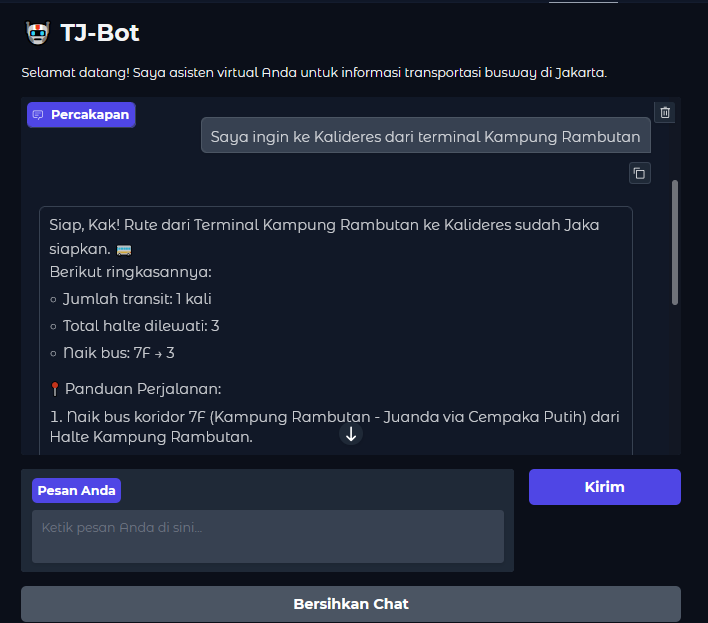
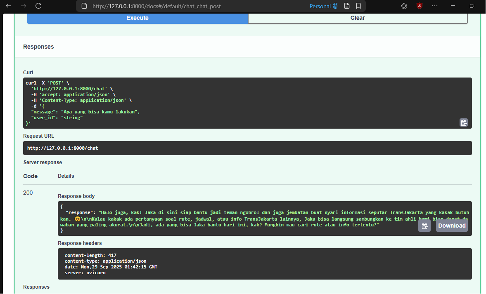

# 🚍 TJ-Bot: TransJakarta Smart Assistant

[](https://huggingface.co/spaces/imampamuji/TJ-bot)

TJ-Bot is an AI-powered chatbot that helps TransJakarta passengers **find routes, answer questions, and provide service info**.
Built with **LangChain, Gemini API, and GTFS data**, with integration options for **API, WhatsApp, and Telegram**.

---

## ✨ Features

* 🔎 **Route Finder** → Find bus routes (GTFS data).
* 🤖 **Intent Classifier** → Detects route / question / smalltalk.
* 📚 **RAG** → Answers knowledge-based queries.
* 💬 **API & Bot Integration** → Runs via API, WhatsApp, or Telegram.

---
## 🛠️ Tech Stack

- Language Model → Google Gemini API (LLM)
- Orchestration → LangChain + LangGraph
- Data → GTFS (TransJakarta route data)
- Backend → FastAPI (REST API)
- Vector DB → ChromaDB (for RAG pipeline)
- Messaging → Telegram Bot API, Gradio

---

## 🏗️ Architecture


---

## ⚡ Quick Start

```bash
# Clone repo
git clone https://github.com/imampamuji/TJ-Bot.git
cd TJ-Bot

# Setup environment
python -m venv .venv
source .venv/bin/activate   # Mac/Linux
.venv\Scripts\activate      # Windows
uv sync
```

Add `.env`:

```
GEMINI_API_KEY=your_api_key_here

```

Run bot:

```bash
uv run main.py
uv run uvicorn api:app --reload --port 8000
```

Test:

```bash
curl -X POST http://localhost:8000/chat \
  -H "Content-Type: application/json" \
  -d '{"message":"route from Kampung Rambutan to Lebak Bulus"}'
```

---

## 💬 Example Interaction

### Chat Gradio Interface 



You can try!  [](https://huggingface.co/spaces/imampamuji/TJ-bot)

### API Documentation



---

## 📊 Showcase

* AI for **public transport & smart city**.
* Modular pipeline (LLM + RAG + Route Finder).
* Multi-platform: CLI, API, WhatsApp, Telegram.

---

## License

This work is licensed under a
[Creative Commons Attribution 4.0 International License][cc-by].

[![CC BY 4.0][cc-by-image]][cc-by]

[cc-by]: http://creativecommons.org/licenses/by/4.0/
[cc-by-image]: https://i.creativecommons.org/l/by/4.0/88x31.png